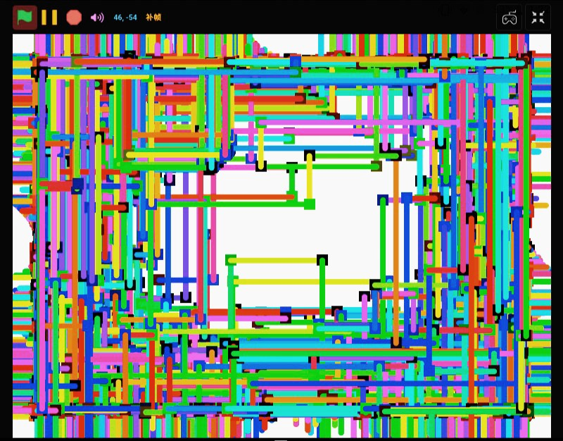

# qqtuomiao的个人网盘

#### 介绍

存放Scratch作品

使用的编辑器 turbowarp 链接:https://turbowarp.org/editor

#### 使用说明

  一般分为三个类型

1.初始项目文件（sb3）

2.打包好的应用(apk)

3. 以及快捷打开（html）

#### 媒体账号

【宋孟德的个人空间-哔哩哔哩】 https://b23.tv/rxDirl2

 QQ资源群:770852700

#### 示例

